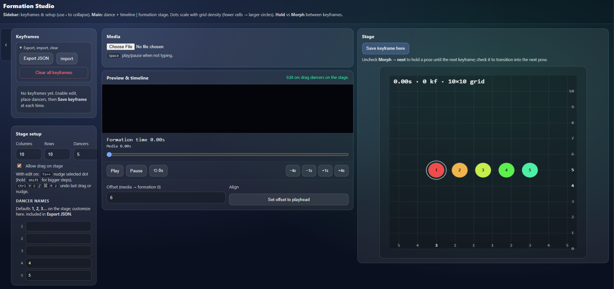

# Formation Studio

Plan dance formations on a **grid stage** while scrubbing **video or audio**. Save positions as **keyframes** in formation time (seconds from a configurable offset), choose **hold** or **morph** into the next shape, and export everything as **JSON** for backup or sharing.

Serve the folder locally (see **Run locally** below) or deploy the same static files to [GitHub Pages](https://pages.github.com/) for a public demo URL.

---

## Why I built this

I built Formation Studio to make it easier to plan dance formations while syncing movement changes to music or video. Instead of sketching formations manually, choreographers can place dancers on a grid, save timed keyframes, and preview transitions between shapes.

---

## Features

- Synced **media player** + **formation timeline** with offset (when “0s” hits in your track)
- **Editable grid**: columns (3–10) and rows (3–10), symmetric column labels, row labels 0…n, top margin row
- **Drag dancers** on the canvas (edit mode), per-dancer names, dot size scales with column count
- **Keyframes**: time, morph-to-next toggle, jump / delete
- **Import / export** JSON (version 2; legacy `gridDivisions` still supported)
- **Autosave** to `localStorage` (this browser only) — project restores on next visit
- **Undo** last drag or arrow nudge: **Ctrl+Z** (Windows/Linux) or **⌘+Z** (macOS)
- **Arrow keys** nudge the selected dancer by 0.5% (hold **Shift** for 2%) when edit mode is on
- Collapsible sidebar

---

## Keyboard

| Key | Action |
|-----|--------|
| **Space** | Play / pause (when focus is not in an input or button) |
| **Ctrl+Z** / **⌘+Z** | Undo last dancer move (drag or arrow nudge); not while typing in a field |
| **Arrow keys** | Nudge selected dancer (↑↓←→); **Shift** = larger step |
| | Requires **Allow drag on stage** and not playing |

---

## Tech stack

- Vanilla **HTML / CSS / JavaScript** (ES modules, no bundler)
- **Canvas 2D** for the stage

---

## Run locally

ES modules usually require **HTTP** (not `file://`). From the project root:

```bash
python -m http.server 8080
```

Open **http://localhost:8080** in your browser.

### Import JSON

1. Sidebar → open **Export, import, clear** → **Import**
2. Pick a `.json` file from this app (or compatible: must include a `keyframes` array)
3. Errors appear in the status line under the timeline; details in the browser console (F12)

### Autosave

- Saves **grid, dancers, names, offset, keyframes** (including keyframe ids) in the browser.
- Does **not** store media files — re-upload video/audio after refresh if needed.
- Cleared if you clear site data for the origin.

---

## Repo layout

| Path | Role |
|------|------|
| `index.html` | Page structure |
| `styles.css` | Layout and components |
| `js/main.js` | Entry: DOM, media, keyframes, import/export, pointers, shortcuts |
| `js/state.js` | App state |
| `js/grid.js` | Grid math and column/row labelling |
| `js/interpolate.js` | Default positions, hold/morph interpolation |
| `js/stage.js` | Canvas rendering and hit geometry |
| `js/project.js` | Export object shape and file import parsing |
| `js/autosave.js` | `localStorage` snapshot load/save |

---

## Export file format (`formation-project.json`)

Version **2** fields:

- `offsetSec` — media time at formation time 0  
- `dancerCount`  
- `gridCols`, `gridRows`  
- `dancerNames`  
- `keyframes[]` — `timeSec`, `morphToNext`, `positions[]` as `{ x, y }` in **percent** (0–100) for stage width and usable vertical band  

Older files with only `gridDivisions` apply that value to both columns and rows.

---

## Screenshots



---
